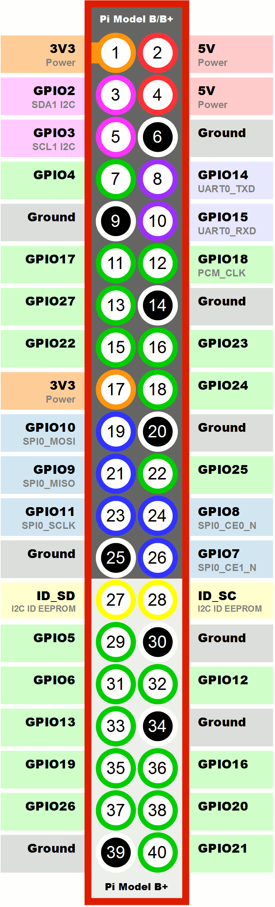

# Hardware Wiring Guide

This directory contains the physical pin configurations, C drivers, and Fritzing schematics (`schematics/`) for the handheld console. 

The hardware architecture is designed specifically for the **Raspberry Pi 3 Model A+**, utilizing its 40-pin GPIO header.

## Prerequisites & Setup (Linux / Raspberry Pi OS)

Before compiling or running the hardware code, ensure you have installed the required system tools and the `lgpio` library.

### 1. Update system packages
```bash
sudo apt update
```

### 2. Install Build Tools and CMake
```bash
sudo apt install build-essential cmake -y
```

### 3. Install the lgpio library
```bash
sudo apt install liblgpio-dev -y
```

### 4. Enable Hardware Power/Wake Button (GPIO 3)
To enable turning the Raspberry Pi on and off using a physical button connected to GPIO 3 (Pin 5) and GND, configure the system overlay:

1. Open the system configuration file:
   ```bash
   sudo nano /boot/firmware/config.txt
   ```
2. Add the following line at the very end of the file:
    ```text
    dtoverlay=gpio-shutdown
    ```
3. Save and exit (`Ctrl + O`, then `Enter`, then `Ctrl + X`).

4. Reboot the system to apply the changes:
   ```bash
   sudo reboot
   ```
**Components**

* **4-Pin Tactile Buttons (Input)**
  * **Breadboard Placement:** Always mount the buttons across the center dividing trench of the breadboard to prevent internal rails from shorting the pins.
  * **Pin Connection (Diagonal Rule):** Always wire the **diagonally opposite legs**. Connect one leg to the assigned GPIO pin, and the diagonally opposite leg directly to the Ground (GND) rail.
  * **Circuit Logic:** Active-low logic. Do not connect to 3.3V or 5V power pins.

**Wire Color Conventions**
* **Grey:** Grounding wires (GND)
* **Red:** Power Button Signal (GPIO 3 wake-up signal only, NOT a voltage supply)

**GPIO Pin Mapping (BCM Numbering)**

**System Controls**
* Power Button: GPIO 3

**D-Pad**
* Up Arrow: GPIO 20
* Down Arrow: GPIO 16
* Left Arrow: GPIO 21
* Right Arrow: GPIO 12

**Action & Menu Buttons**
* Button B (Left): GPIO 13
* Button A (Right): GPIO 6

* Select Button (Left): GPIO 26
* Start Button (Right): GPIO 19

*Note: The hardware pinout documented here must always stay synchronized with the macro definitions in `include/console_config.h`.*

## Building and Running the Code

Once the setup is complete, navigate into the `hardware` directory, build the project using CMake, and run the test binary:

```bash
cd hardware
make
./build/test_buttons
```

## Visual Reference

<!-- TO DO LA FINAL SA ADAUG BREADBOARD -->
<!-- 
*Figure 1: Complete breadboard wiring schematic.* -->


<br>
<em>Figure 1: Raspberry Pi 3 Model A+ BCM Pinout Reference.</em>